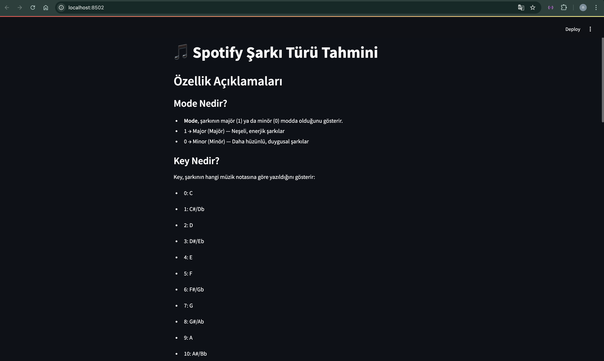
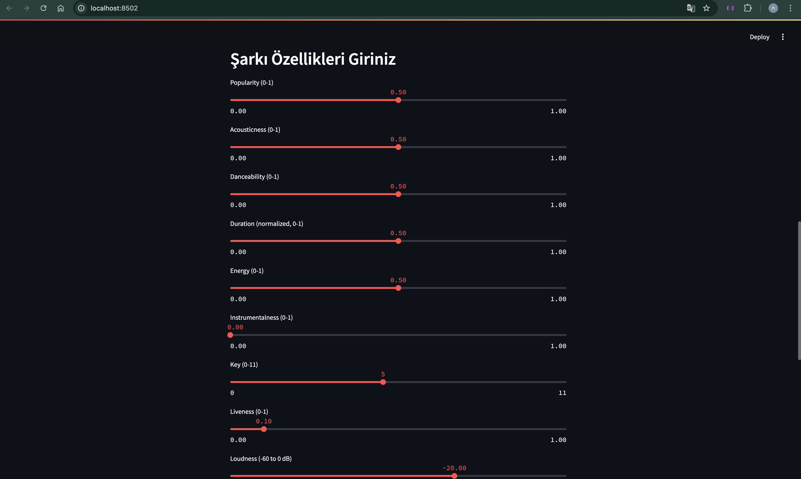
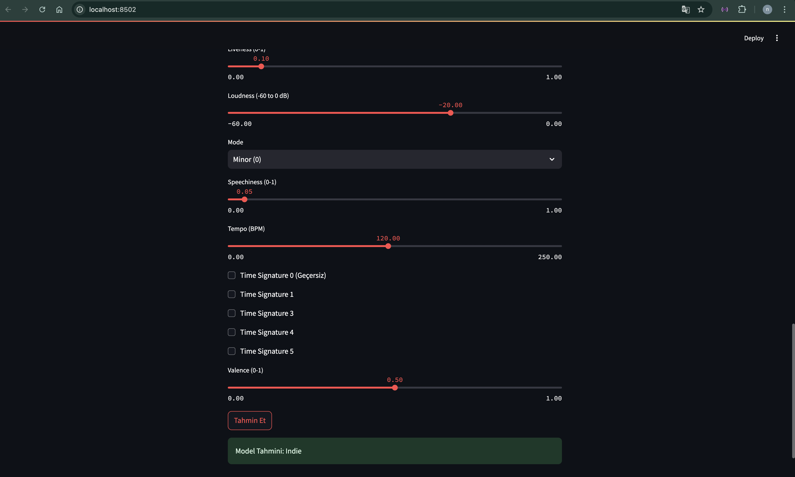

# Spotify Genre Classification with Machine Learning

## Akbank Machine Learning Bootcamp

Bu proje, Spotify şarkı verileri üzerinde çok sınıflı bir sınıflandırma problemi çözerek şarkının türünü (genre) tahmin etmeyi amaçlamaktadır. Python, Scikit-learn ve XGBoost gibi kütüphaneler kullanılarak veri analizi, model eğitimi ve değerlendirme aşamaları detaylıca gerçekleştirilmiştir.

## Proje Amacı

Bu projede, Spotify'ın sağladığı çeşitli şarkı özellikleri kullanılarak şarkının ait olduğu müzik türünü tahmin etmek amaçlanmaktadır. Gözetimli öğrenme (supervised learning) yöntemleriyle çoklu sınıf (multiclass) sınıflandırma problemi çözülmektedir.

## Veri Seti

- **Kaynak:** [Kaggle - Spotify Tracks DB](https://www.kaggle.com/datasets/zaheenhamidani/ultimate-spotify-tracks-db)
- **Dosya:** SpotifyFeatures.csv

## 🛠️ Veri Ön İşleme

- Gereksiz sütunlar silindi (track_id, artist_name, track_name)
- Nadir sınıflar çıkarıldı
- Kategorik veriler sayısallaştırıldı
- Korelasyon analizine göre filtreleme yapıldı
- Label Encoding, One-hot encoding ve Normalizasyon uygulandı

## Modelleme ve Eğitim

- **Logistic Regression** - Basit ve yorumlanabilir model
- **Random Forest** - Topluluk modeli (ensemble)
- **XGBoost** - En iyi sonucu veren gelişmiş boosting modeli  
*Not:* XGBoost için RandomizedSearchCV ile hiperparametre optimizasyonu yapıldı

## 📈 Model Performansı ve Görselleştirme

Tüm modeller `cross_val_score` ile değerlendirildi ve **accuracy, F1-score** gibi metriklerle karşılaştırıldı.

## Proje Sonuçları ve Yorumlar

Bu projede Spotify şarkı türü sınıflandırması üzerine çalıştım ve üç farklı makine öğrenmesi modeli (Lojistik Regresyon, Random Forest, XGBoost) kullandım. Modellerin performanslarını karşılaştırarak en iyi sonucu veren modeli belirledim.

- **Lojistik Regresyon modeli**, temel bir lineer sınıflandırıcı olarak başlangıç performansı sağladı. Model, doğruluk oranı açısından makul seviyelerde olsa da, karmaşık veri yapısında sınıf farklılıklarını yakalamakta zorlandı.
- **Random Forest**, bir ansamble yöntemi olarak, karar ağaçlarının topluluğu sayesinde daha yüksek doğruluk ve genelleme kabiliyeti gösterdi. Verideki karmaşık ilişkileri daha iyi yakalayarak modelin doğruluğunu artırdı.
- **XGBoost**, gelişmiş gradyan artırma algoritması olarak, hem doğruluk hem de genel model performansı açısından en iyi sonucu verdi. RandomizedSearchCV ile yapılan hiperparametre optimizasyonu, modelin overfitting riskini azaltırken test setinde en yüksek doğruluğa ulaşmasını sağladı.

- **Deploy**
Projeyi Streamlit ile deploy ederek, makine öğrenmesi modelini interaktif bir web uygulamasına dönüştürdüm. Kullanıcılar, web üzerinden şarkı özelliklerini girip tür tahmini yapabiliyor.

## Proje Arayüzünden Ekran Görüntüleri  

  

  

  

## Projeyi Çalıştırma ve Deploy Etme
Projeyi yerel makinenizde çalıştırmak için şu adımları izleyin:

Gerekli paketleri yükleyin:
  pip install -r requirements.txt  

Streamlit arayüzünü başlatın:
  streamlit run spotify_app.py 

## Gereksinimler

- Python 3.8+
- pandas
- numpy
- scikit-learn
- xgboost
- seaborn
- matplotlib
- streamlit
- joblib
- numpy

##  Sonuç ve Gelecek Çalışmalar
Bu proje kapsamında, Spotify şarkı verileri üzerinde gerçekleştirdiğim çok sınıflı müzik türü sınıflandırma çalışması ile makine öğrenmesi süreçlerine dair kapsamlı bir deneyim kazandım. Her ne kadar elde edilen doğruluk oranları ideal seviyelere ulaşmamış olsa da, bu durum veri setindeki sınıflar arasındaki dengesizlik, sınıfların birbiriyle olan örtüşmesi ve müzik türlerinin sayısal temsili gibi zorluklara işaret etmektedir. Bu bağlamda proje, makine öğrenmesi modelleme sürecinde gerçek dünya verisiyle çalışmanın zorluklarını ve modelin başarısını etkileyen kritik faktörleri keşfetmemi sağladı.

## Gelecek Yönelimler
Bu çalışmayı daha güçlü ve etkili bir hale getirebilmek için aşağıdaki geliştirme alanlarına odaklanmayı planlıyorum

# Veri Kalitesinin Artırılması
Mevcut veri seti yerine Spotify API üzerinden daha dengeli, güncel ve kapsamlı veri toplayarak daha sağlam bir eğitim seti oluşturulabilir. Özellikle tür başına örnek sayısını artırmak, modelin genelleme gücünü doğrudan artıracaktır.

# Yeni Özellik Mühendisliği
Mevcut sayısal özelliklerin yanı sıra; şarkı sözleri, tempo değişimleri, akor yapısı gibi müzikal metriklerden türetilmiş yeni değişkenler eklenerek modelin öğrenme kapasitesi artırılabilir.

# Model Seçimi ve Derin Öğrenme Yaklaşımları
Geleneksel algoritmalar yerine, ses dosyalarını doğrudan analiz edebilen derin öğrenme modelleri (örneğin CNN veya LSTM tabanlı modeller) ile daha güçlü temsiller öğrenilebilir.

# Çok Etiketli (Multi-label) Sınıflandırma
Bazı şarkıların birden fazla türe ait olması gerçeği göz önüne alındığında, problem çok etiketli sınıflandırma problemine dönüştürülerek daha gerçekçi tahminler yapılabilir.

## Kaggle linkleri

- https://www.kaggle.com/code/nurselidemir/datapreprocessing
- https://www.kaggle.com/code/nurselidemir/supervised
